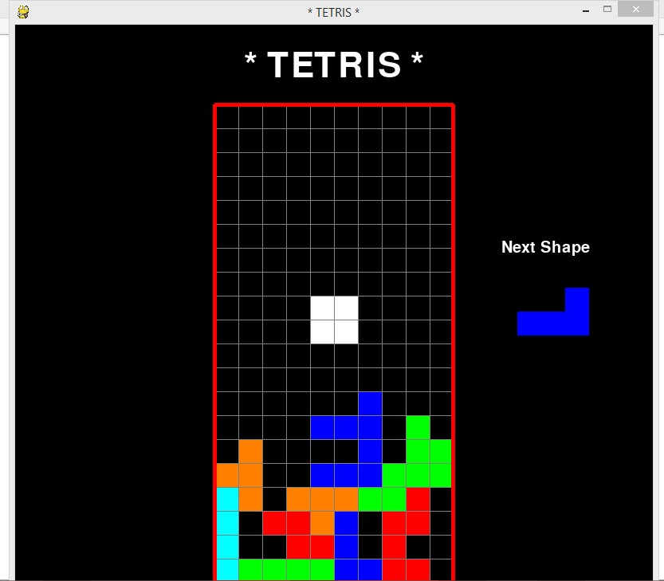
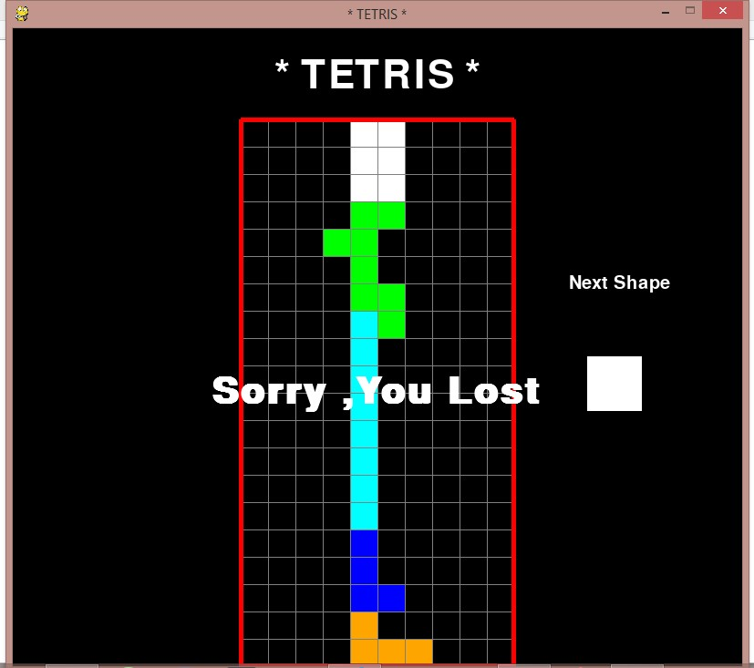

# Tetris-game
Tetris game using python 

The game is based on the pygame library

pygame is a set of Python modules designed for writing video games. Pygame adds functionality on top of the excellent SDL library. This allows you to create fully featured games and multimedia programs in the python language.

Documentation- https://www.pygame.org/docs/

Controls
The following list contains used control keys:

* Any key to start the game
* Up Arrow - to change the rotation of tetris block
* Left and Right Arrow - to change the direction(left or right) of tetris block

 
